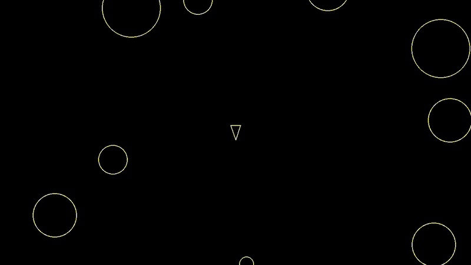

# Astroblast
Is a game that is set in space in which you have to evade and destroy moving asteroids.  
The graphics are 2D like space invaders from the last century.

 

## 🏆 Motivation
A game like this is a great way to build a project,  
because you receive immediate feedback from the code that is being turned into a game. 

## 💬 Disclaimer:
This is a project that started out from boot.dev - I recommend to check them out!  
The source code is not entirely written by me.    
Especially the math was done for me by boot.dev.  
I added and will add more features myself as time goes on. 

## 🚀 Quick Start
### Linux
1. Install Git and Python3 via the commandline.

2. Create and navigate to the directory where you want to store the repo:
```
mkdir ~/projects
cd ~/projects
```

3. Clone the repository:
```
git clone https://github.com/ar-ho/astroblast.git
```

4. Execute main.py.
```
python3 ~/projects/astroblast/main.py
```

### Windows
1. Install Git and Python3.

2. Add Git and Python3 to your PATH environment variable.

3. Clone the repo using the Git bash cli for windows.

4. Execute main.py

## 📖 Usage
- Use WASD keys to move and space for shooting.

## 🤝 Contributing
Feel free to clone, use and enhance this code.
### Submit a pull request
If you would like to contribute, please fork the repository and open a pull request to the `main` branch.